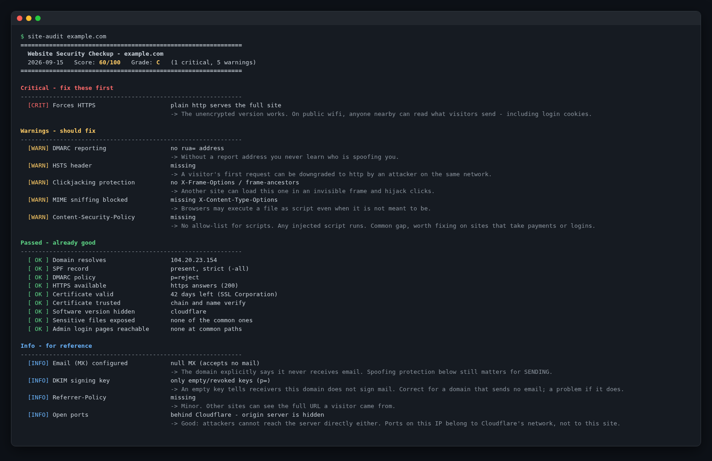

# site-audit

[](.github/workflows/ci.yml)


**An outside-in website security checkup in a single Bash script.** Point it at
a domain and in a few seconds you get a scored report (0-100, grade A-F) that
covers email spoofing protection, HTTPS and certificates, security headers,
cookies, exposed files, admin panels and risky open ports. It sees exactly what
an attacker on the internet can see, and nothing more.

It needs no agent, no login and no access to the target. It is non-intrusive:
it only makes DNS lookups, a few ordinary HTTPS requests and plain TCP connects.



**Why it exists:** most small-business sites fail the same dozen basics
(a missing DMARC record, no HSTS, an exposed `.env`, a database port open to
the world). Commercial scanners cost money, need sign-up, or bury those
basics under hundreds of low-value findings. `site-audit` checks the ones that
actually get sites breached or spoofed, and explains each finding in plain
language that a non-technical owner can act on.

---

## Contents

- [Quick start](#quick-start)
- [What it checks](#what-it-checks)
- [Scoring model](#scoring-model)
- [Usage](#usage)
- [Automation: cron and CI](#automation-cron-and-ci)
- [JSON output](#json-output)
- [Avoiding false positives](#avoiding-false-positives)
- [Design notes](#design-notes)
- [Development](#development)
- [Limitations](#limitations)
- [Roadmap](#roadmap)
- [Responsible use](#responsible-use)

## Quick start

```bash
git clone https://github.com/jlugo32/site-audit.git
cd site-audit
./site-audit example.com
```

**Requirements:** Bash 4.4+, `dig`, `curl`, `openssl`, and coreutils
(`timeout`, `date`, `mktemp`). Nothing else is needed: no Python, no Node, no
Docker.

| Platform | Install dependencies |
|---|---|
| Debian / Ubuntu | `sudo apt-get install dnsutils curl openssl coreutils` |
| RHEL / Fedora | `sudo dnf install bind-utils curl openssl coreutils` |
| macOS (Homebrew) | `brew install bash bind curl openssl coreutils` |

On macOS the default Bash is 3.2, so `brew install bash` (4.4+) is required.
Homebrew's coreutils installs GNU `timeout` as **`gtimeout`**; add its gnubin
directory to your `PATH` so `site-audit` finds a `timeout`:

```bash
export PATH="$(brew --prefix)/opt/coreutils/libexec/gnubin:$PATH"
```

If anything is missing, the script tells you which command it needs and how to
install it, then exits with code `3`.

To install system-wide:

```bash
sudo install -m 0755 site-audit /usr/local/bin/site-audit
```

## What it checks

Severity is what the finding counts as **when the check fails**. Passing
checks are listed as `OK` and cost nothing.

| Area | Check | Severity when failing |
|---|---|---|
| DNS | Domain resolves (A record) | Critical, and the audit stops |
| DNS | MX records (detects RFC 7505 null MX) | Info |
| Email spoofing | SPF record missing, or `+all` (authorises everyone) | Critical |
| Email spoofing | SPF `?all` / no `all` / multiple SPF records | Warning |
| Email spoofing | SPF `redirect=` (policy delegated to another domain) | OK |
| Email spoofing | DMARC `p=reject`/`quarantine` but `pct` below 100 | Warning |
| Email spoofing | DKIM key on 19 common selectors | Warning (Info if only revoked `p=` keys) |
| Email spoofing | DMARC record missing | Critical |
| Email spoofing | DMARC `p=none` or unclear policy | Warning |
| Email spoofing | DMARC without `rua=` reporting address | Warning |
| HTTPS | Site answers on https | Critical |
| HTTPS | Plain http serves the site instead of redirecting | Critical |
| HTTPS | http redirects somewhere that is not https | Warning |
| TLS | Certificate expired | Critical |
| TLS | Certificate expires in under 14 days, or cannot be read | Warning |
| TLS | Certificate chain / hostname not trusted | Critical |
| Headers | `Strict-Transport-Security` (HSTS) | Warning |
| Headers | `X-Frame-Options` or CSP `frame-ancestors` (clickjacking) | Warning |
| Headers | `X-Content-Type-Options` | Warning |
| Headers | `Content-Security-Policy` | Warning |
| Headers | `Referrer-Policy` | Info |
| Headers | `Server` / `X-Powered-By` leak a version number | Warning |
| Cookies | `Set-Cookie` without `Secure` | Warning |
| Cookies | `Set-Cookie` without `HttpOnly` | Warning |
| Network | Risky ports reachable: FTP, Telnet, MySQL, PostgreSQL, Redis, MongoDB, hosting/admin panels (cPanel, WHM, Plesk, Webmin, Cockpit...) | Critical |
| Network | All open ports among 25 probed, including SSH and mail | Info |
| Exposure | `.env`, `.git/`, `*.bak`, `backup.zip`, `*.sql`, `.htpasswd`, `server-status`, `phpinfo`, `.DS_Store`, `composer.json`, `package.json` | Critical |
| Exposure | Admin login pages at `wp-login.php`, `wp-admin/`, `admin/`, `administrator/`, `phpmyadmin/`, `adminer.php`, `manager/`... (a bare `/login` customer page is not flagged) | Warning |
| Exposure | WordPress `xmlrpc.php` enabled | Warning |
| Hygiene | `www.` version does not work | Info |
| Bonus | `/.well-known/security.txt` published | OK (no penalty if absent) |

Every finding carries a one-line **"why it matters"** explanation written for
the site owner, not for a security engineer.

## Scoring model

```
score = 100 - 15 x (critical findings) - 5 x (warnings)      floored at 0

A >= 90    B >= 75    C >= 60    D >= 40    F < 40
```

The scoring model is deliberately simple and transparent. A single critical
issue (such as an exposed `.env`) drops a perfect site to a B. Three criticals
put it at a D, because at that point the site is realistically at risk.
Informational findings never cost points.

## Usage

```text
Usage: site-audit <domain> [options]

Options:
  --md FILE          Also write a markdown report to FILE ("-" = stdout only)
  --json             Print JSON to stdout instead of the terminal report
  --fail-under N     Exit 1 when the score is below N (0-100); for CI / cron
  --no-ports         Skip TCP port probing
  --timeout SEC      Per-request timeout in seconds (default 12; per request,
                     not a cap on the whole audit)
  --color / --no-color
                     Force or disable ANSI colours (default: auto, honours NO_COLOR)
  -h, --help         Show this help
  -V, --version      Show version
```

```bash
# Terminal report
site-audit example.com

# Also save a client-ready markdown report
site-audit example.com --md reports/example.com.md

# Markdown only, straight to stdout (e.g. pipe into pandoc)
site-audit example.com --md - | pandoc -o report.pdf

# Machine-readable
site-audit example.com --json | jq '.score, .grade'

# Web and DNS checks only, no port probing
site-audit example.com --no-ports
```

URLs are normalised for you: `https://www.Example.com/` is audited as
`example.com`. Anything that is not a plain domain is rejected with exit code
`2`, including paths, query strings, ports, IP addresses and shell
metacharacters.

### Exit codes

| Code | Meaning |
|---|---|
| `0` | Audit completed (and score >= `--fail-under`, if given) |
| `1` | Score is below `--fail-under` |
| `2` | Usage error or invalid domain |
| `3` | A required command is missing |
| `4` | Domain does not resolve |

Sample reports from a live run against `example.com` (IANA's reserved
documentation domain) are in [`examples/`](examples/):
[terminal](examples/example.com.txt), [markdown](examples/example.com.md) and
[JSON](examples/example.com.json).

## Automation: cron and CI

### Weekly cron job with an alert

```cron
# Every Monday 07:00: keep a JSON history, and email when the grade drops below B
0 7 * * 1  /usr/local/bin/site-audit example.com --json > /var/log/site-audit/example.com-$(date +\%F).json; /usr/local/bin/site-audit example.com --no-color --fail-under 75 > /tmp/site-audit.txt || mail -s "site-audit: example.com below 75" ops@example.com < /tmp/site-audit.txt
```

### GitHub Actions gate

Fail a deploy pipeline if a site's security posture regresses:

```yaml
name: security-posture
on:
  schedule: [{ cron: "0 6 * * *" }]
  workflow_dispatch:

jobs:
  audit:
    runs-on: ubuntu-latest
    steps:
      - uses: actions/checkout@v4
      - run: sudo apt-get update -qq && sudo apt-get install -y -qq dnsutils
      - name: Audit production domain
        run: ./site-audit example.com --no-color --md report.md --fail-under 75
      - if: always()
        uses: actions/upload-artifact@v4
        with:
          name: site-audit-report
          path: report.md
```

## JSON output

`--json` emits a single stable document. Every finding includes the points it
cost, so dashboards can explain the score.

```json
{
  "tool": "site-audit",
  "version": "1.1.0",
  "domain": "example.com",
  "generated_at": "2026-09-15T10:42:18Z",
  "score": 60,
  "grade": "C",
  "summary": {"critical": 1, "warning": 5, "ok": 9, "info": 4},
  "findings": [
    {"severity": "OK", "check": "SPF record", "result": "present, strict (-all)", "why": "Receivers are told to reject mail from unlisted servers.", "penalty": 0},
    {"severity": "CRITICAL", "check": "Forces HTTPS", "result": "plain http serves the full site", "why": "The unencrypted version works. On public wifi, anyone nearby can read what visitors send - including login cookies.", "penalty": 15},
    {"severity": "WARNING", "check": "HSTS header", "result": "missing", "why": "A visitor's first request can be downgraded to http by an attacker on the same network.", "penalty": 5},
    {"severity": "INFO", "check": "Open ports", "result": "behind Cloudflare - origin server is hidden", "why": "Good: attackers cannot reach the server directly either. Ports on this IP belong to Cloudflare's network, not to this site.", "penalty": 0}
  ]
}
```

(Excerpt. See [`examples/example.com.json`](examples/example.com.json) for a full run.)

For a domain that does not resolve, the JSON is
`{"tool": "site-audit", ..., "error": "domain does not resolve"}` and the exit
code is `4`.

## Avoiding false positives

A security report that raises false alarms trains people to ignore it. These
guards came from auditing real sites:

1. **Scanning your own server.** When a host connects to its own public IP, the
   traffic loops back internally and never passes through the firewall, so
   every port looks open. `site-audit` compares the target IP with the local
   machine's addresses (`hostname -I`). If they match, it reports ports as
   "not testable from this machine" instead of listing phantom criticals.
2. **CDN edges.** Behind Cloudflare, the IP you reach belongs to the CDN, and
   Cloudflare's edge answers on 2082/2083/2086/2087/8080/8443 for *every*
   proxied site. `site-audit` detects Cloudflare, CloudFront, Fastly, Akamai,
   Vercel and Netlify from response headers (`Server`, `cf-ray`,
   `x-amz-cf-id`...). It then skips port probing and reports that the origin is
   hidden, which is good news for the site.
3. **Catch-all sites.** Single-page apps and many CMSs answer `200 OK` with the
   home page for any URL, so a naive scanner "finds" `.env`, `.git/HEAD` and
   `phpmyadmin/` on them. Here a path only counts if the body matches what that
   file really looks like. For example, `.env` must contain `KEY=value` lines
   and not HTML, `.git/HEAD` must start with `ref:`, a zip must start with the
   `PK` magic bytes, and a login page must contain a password field. Only the
   first 4-64 KB of each response is fetched.
4. **Revoked DKIM keys.** A record with an empty `p=` is a deliberate
   "this domain never signs mail" statement, not an active key. It is reported
   as Info rather than as a pass or a failure.
5. **DMARC tag parsing.** Tags are parsed properly, so `sp=reject; p=none` is
   read as `p=none`. A naive `grep p=` would pick up the `sp=` value.
6. **Cookie flags.** Flags are matched as attributes, so a cookie *named*
   `secure_token` does not count as `Secure`.
7. **Apex-to-www redirects.** Security headers are read from the page the site
   actually serves. If the apex 301s to `www.` (or http to https), `site-audit`
   follows that one same-site hop before reading headers, so a bare redirect is
   not reported as "all headers missing". Off-site redirects are not trusted:
   the origin's own headers are used instead.
8. **SPF `redirect=`.** A record such as `v=spf1 redirect=icann.org` delegates
   its policy to another domain. That is valid configuration, so it is reported
   as OK rather than "no `-all`".
9. **Private/loopback A records.** If a domain resolves to a loopback or
   RFC 1918 address, port probing would scan the local network rather than the
   site, so it is skipped and reported as "not testable".
10. **Customer sign-in pages.** Only admin-specific paths (`/wp-admin`,
    `/administrator`, `/phpmyadmin`, `/manager`...) are flagged. A normal
    `/login` or `/signin` for end users is not treated as an exposed admin door.

## Design notes

- **One file, no runtime dependencies beyond standard CLI tools.** You can copy
  it onto any Linux box, jump host or CI runner and run it.
- **Layered structure.** The script has six sections: constants, pure helpers
  (parsing and maths), CLI, a thin network layer, checks, and renderers. Checks
  never call `dig` or `curl` directly. They go through `dns_query`,
  `http_headers`, `http_body_to` and similar wrappers, which is what lets the
  test suite replay fixtures with no network.
- **Sourceable.** The script only runs when executed directly
  (`[[ "${BASH_SOURCE[0]}" == "$0" ]]`), so tests can `source` it and call
  individual functions.
- **Strict mode that actually holds.** It runs under `set -euo pipefail`. Every
  expected non-zero exit (no grep match, curl timeout) is handled explicitly.
  Checks are never called from `if`/`||` contexts, where bash silently turns
  `errexit` off. Greps inside pipelines avoid `-q` to rule out SIGPIPE
  surprises under `pipefail`.
- **Untrusted input stays inert.** Remote header values are stripped of
  control characters before printing, so a hostile server cannot inject
  terminal escape sequences. JSON strings are escaped, and markdown table cells
  escape `|`. The domain argument is validated against RFC 1123 before it ever
  reaches a command.
- **Fast.** The 25 port probes run in parallel (worst case about 3 s rather
  than about 75 s). A typical full audit finishes in a few seconds; it can take
  ~15 s against a slow origin or one that stalls the TLS handshake (each network
  request is bounded by `--timeout`, default 12 s).

## Development

```bash
make lint        # shellcheck -x site-audit tests/run.sh
make test        # offline test suite (no network)
make test-live   # plus a live smoke test against example.com
make examples    # regenerate examples/ from a live run
```

The test suite is plain Bash with no framework:

- **Unit tests** for scoring and grade boundaries, domain validation (including
  injection attempts), SPF/DMARC/DKIM/MX parsing, header parsing, CDN
  detection, cookie flags, certificate date maths, file signatures, JSON
  escaping and control-character sanitising.
- **Fixture audits:** the network layer is stubbed with canned DNS answers,
  headers and response bodies from [`tests/fixtures/`](tests/fixtures/). Whole
  audits then run under `set -euo pipefail` for a hardened site, a neglected
  site, a CDN-fronted catch-all site, a self-hosted target and several edge
  cases, asserting the exact score and findings.
- **CLI tests** for every exit code, `--json` validity, `--fail-under`,
  markdown output, colour handling and hostile-header sanitising.

```text
$ bash tests/run.sh
...
240 passed, 0 failed, 1 skipped
```

CI runs ShellCheck and the full offline suite on every push
([`.github/workflows/ci.yml`](.github/workflows/ci.yml)).

## Limitations

- **Outside view only.** It cannot see application vulnerabilities, outdated
  plugins behind a hidden version string, or server configuration. A clean
  report is a good baseline, not a penetration test or a compliance
  certificate.
- **DKIM selectors can't be listed from outside.** Only 19 common selectors
  are tried, so a custom selector shows up as a "none found" warning.
- **IPv4, first A record.** IPv6 and additional A records are not probed.
- **Homepage headers.** Security headers and cookies are read from the page the
  site serves for `https://<domain>/`, following at most one same-site redirect
  (apex to `www.`, http to https). Pages deeper in the site may differ.
- **TCP connect only.** Open ports are detected but services are not
  fingerprinted.
- **WAFs and rate limits** may block some requests. Blocked requests show up
  as `000`/`403` and can hide findings.
- **`www.` is stripped** from the input, so the apex domain is audited.
- **Userland portability.** GNU coreutils are assumed. On macOS, install
  coreutils (its `timeout` is `gtimeout`; put its gnubin on `PATH`) and a
  current Bash. Certificate date parsing falls back automatically to BSD `date`
  (macOS) and to a busybox-compatible parser (Alpine).

## Roadmap

- [ ] IPv6 and multi-A-record port probing
- [ ] MTA-STS, TLS-RPT, BIMI, CAA and DNSSEC checks
- [ ] TLS protocol and cipher checks (flag TLS 1.0/1.1, weak ciphers)
- [ ] Batch mode: audit a list of domains and output a comparison table
- [ ] Configurable weights and per-check suppression (`.site-audit.conf`)
- [ ] Self-contained HTML report
- [ ] SARIF output for GitHub code-scanning dashboards

## Responsible use

**Only scan domains you own or are explicitly authorised to test.** The checks
are non-intrusive and use only publicly available information, but port
probing and path discovery against systems you have no permission to test may
breach acceptable-use policies or local law. When auditing for a client, get
written authorisation first. Use `--no-ports` whenever port probing is out of
scope.

## License

[MIT](LICENSE)
